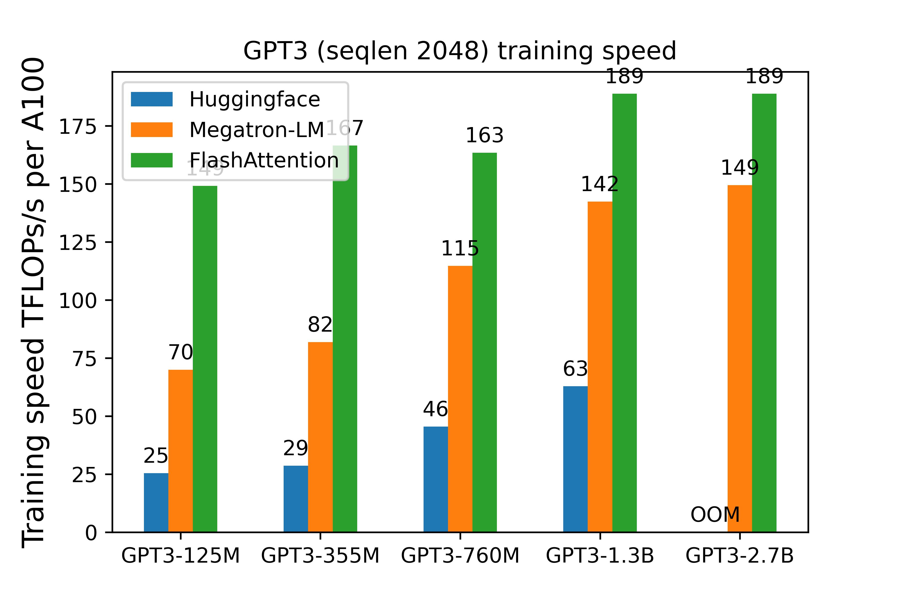
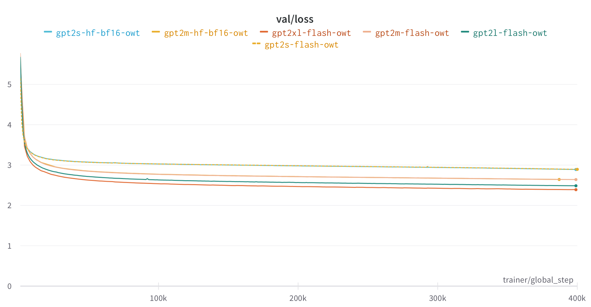
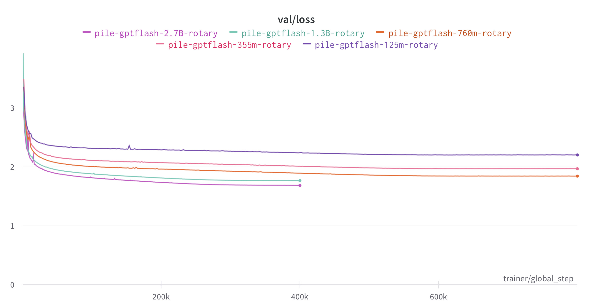

# Optimized Transformer implementation
This repo contains examples of how FlashAttention can be integrated into a model
(e.g., GPT, ViT) and trained end-to-end. We also provide optimized
implementations of other layers (e.g., MLP, LayerNorm, cross-entropy loss,
rotary embedding). Overall this speeds up training by 3-5x compared to the
baseline implementation from Huggingface, reaching up to 189 TFLOPs/sec per A100,
equivalent to 60.6\% model FLOPs utilization (we don't need any activation
checkpointing). All without changing the model architecture (i.e., no
approximation).

Goals:
- Performance: we optimize for model speed and memory, especially on 1-node
  (e.g., with 8 A100s).
- Flexibility: we provide optimized building blocks (MLP, attention, LayerNorm),
  and the model code illustrates how these components can be put together.
  The training code also aims to be model- & task-agnostic.

Non-goals (and other resources):
- Support as many models as possible: Huggingface's
  [transformers](https://github.com/huggingface/transformers) and
  [timm](https://github.com/rwightman/pytorch-image-models/) are great for this.
- Large-scale distributed training: our codebase has been used for multi-GPU and multi-node
  training for models up to 2.7B parameters. However, if you're looking for large-scale distributed
  training techniques (e.g., pipeline parallelism, tensor parallelism),
  check out [Megatron-LM](https://github.com/NVIDIA/Megatron-LM/) and
  [DeepSpeed](https://github.com/microsoft/deepspeed).
- Inference: we currently focus on training (this might change in the future).
  If you want fast inference, take a look at
  [FasterTransformer](https://github.com/NVIDIA/FasterTransformer).
- Production: this codebase was written during several research projects to validate ideas
  on speeding up ML models.

## Model Components

The GPT model is implemented
[here](https://github.com/HazyResearch/flash-attention/blob/main/flash_attn/models/gpt.py).
And here's an example to construct the GPT3-1.3B model with rotary embedding:
```python
from transformers.models.gpt2.configuration_gpt2 import GPT2Config
from flash_attn.models.gpt import GPTLMHeadModel

seqlen = 2048
hidden_dim = 2048
nheads = 16
n_layer = 24
rotary_emb_fraction = 0.5
config = GPT2Config(vocab_size=50257, n_positions=seqlen, n_embd=hidden_dim,
                    n_layer=n_layer, n_head=nheads, 
                    scale_attn_by_inverse_layer_idx=True, 
                    rotary_emb_fraction=rotary_emb_fraction,
                    use_flash_attn=True, fused_dense_gelu_dense=True,
                    fused_bias_fc=True, fused_dropout_add_ln=True, 
                    pad_vocab_size_multiple=8)
model = GPTLMHeadModel(config)
```

We provide the following optimized components:

1. FlashAttention: fast and memory-efficient exact attention. This makes
attention much faster and saves a lot of activation memory. As a result we don't need
to use any activation checkpointing.
```sh
pip install flash-attn
```

2. Fused matmul + bias (forward and backward), and fused matmul + bias + gelu
(forward and backward), adapted from Apex's
[FusedDense](https://github.com/NVIDIA/apex/tree/master/apex/fused_dense). We
make it work for bfloat16. For best performance, you should use CUDA >= 11.8. CuBLAS versions before
this doesn't have the best matmul + bias + gelu performance for bfloat16.
```sh
cd ../csrc/fused_dense_lib && pip install .
```
3. Optimized cross-entropy loss, adapted from Apex's
[Xentropy](https://github.com/NVIDIA/apex/tree/master/apex/contrib/xentropy). We make it work for bfloat16 and support in-place backward to save memory.
```sh
cd ../csrc/xentropy && pip install .
```
4. Fused rotary embedding:
```sh
cd ../csrc/rotary && pip install .
```
5. Fused dropout + residual + LayerNorm, adapted from Apex's
[FastLayerNorm](https://github.com/NVIDIA/apex/tree/master/apex/contrib/layer_norm). We add dropout and residual, and make it work for both pre-norm and post-norm architecture.
This supports dimensions divisible by 8, up to 6144.
```sh
cd ../csrc/layer_norm && pip install .
```

## Training

We also provide here training scripts to train GPT2 on Openwebtext and GPT3 on
The Pile as examples. Feel free to use the model in your own training setup as
well.

We use [Hydra](https://hydra.cc/) for configuration,
[Pytorch-Lightning](https://github.com/Lightning-AI/lightning) for training, and
[Wandb](https://wandb.ai/) for logging.

We use the template from `https://github.com/ashleve/lightning-hydra-template`.
Please read the instructions there to understand the repo structure.

### Requirements

Python 3.8+, Pytorch 1.12+, torchvision, einops, timm, hydra-core,
hydra-colorlog, python-dotenv, rich, pytorch-lightning, triton, flash-attn.
We recommend CUDA 11.8 (e.g., using the Nvidia's Pytorch Docker image from https://catalog.ngc.nvidia.com/orgs/nvidia/containers/pytorch)

We provide a Dockerfile that lists all the required packages.

### Dataset preparation

Running the training command would automatically download the datasets
(Openwebtext, Pile), tokenize with the GPT2 tokenizer, concatenate all the
tokens, then save this cache to disk. Alternatively, you can also prepare the
datasets as a separate step.

The cached datasets are saved to `${DATA_DIR}/openwebtext` and
`${DATA_DIR}/the_pile`. If `${DATA_DIR}` is not set, they will be saved to
`./data/{openwebtext,the_pile}`. 

- Openwebtext:
```sh
export PYTHONPATH=$PWD:$PYTHONPATH
pytest -q -s tests/datamodules/test_language_modeling_hf.py -k "openwebtext"
```
This takes around 1h on a 64-core CPU. The processed dataset has size 17GB.

- The Pile:
```sh
export PYTHONPATH=$PWD:$PYTHONPATH
pytest -q -s tests/datamodules/test_language_modeling_hf.py -k "pile"
```
This takes around 20h on a 64-core CPU. The processed dataset has size 699GB.

### GPT2 training on Openwebtext
To train GPT2 on Openwebtext with 8 GPUs:
```sh
python run.py experiment=owt/gpt2s-flash trainer.devices=8  # 125M
python run.py experiment=owt/gpt2m-flash trainer.devices=8  # 355M
python run.py experiment=owt/gpt2l-flash trainer.devices=8  # 760M
python run.py experiment=owt/gpt2xl-flash trainer.devices=8  # 1.6B
```
The default parameters are set for 8 x A100 80GB.

To train with bf16 instead of fp16, add `trainer.precision=bf16`.

### GPT3 training on The Pile
To train GPT3 on The Pile with 8 GPUs:
```sh
python run.py experiment=pile/gpt3s-flash trainer.devices=8  # 125M
python run.py experiment=pile/gpt3m-flash trainer.devices=8  # 355M
python run.py experiment=pile/gpt3l-flash trainer.devices=8  # 760M
python run.py experiment=pile/gpt3xl-flash trainer.devices=8  # 1.3B
python run.py experiment=pile/gpt3-2.7B-flash-hdim128 trainer.devices=8  # 2.7B
```
The default parameters are set for 8 x A100 80GB. We train with bf16 by default.

To train with rotary embedding, run the experiments `pile/gpt3{s,m,l,xl}-flash-rotary`.

### Training options

**Gradient accumulation**: to adjust device batch size to fit into GPU memory
(the global batch size stays the same, and gradient accumulation is calculated
automatically), set `datamodule.batch_size=blah`.

**Multi-node**: to train on multiple nodes, add `trainer.num_nodes=blah`.

**Speed benchmarking**: to print out iteration time, add `+callbacks.speed_monitor.verbose=True`.

**Resumable training**: set a name to the run, and then set `resume=True` when
you resume. Training will restart at exactly the same batch.
```sh
python run.py experiment=pile/gpt3s-flash trainer.devices=8 name=pile-gpt3s-flash resume=True
```

## Training speed

We measure the wallclock training speed on one node with 8 x A100 80GB SXM4 80GB (400W) with NVLink.

FLOPs are calculated using the formula from the [Megatron-LM
paper](https://arxiv.org/abs/2104.04473) (Section 5.1), except we scale by 3/4
to get the model FLOPs (instead of hardware FLOPs with activation
checkpointing).


### GPT2 (sequence length 1024)


The implementation in this repo (FlashAttention) is 3-4x faster than the
baseline implementation from Huggingface.

### GPT3 (sequence length 2048)



The implementation in this repo (FlashAttention) is 3-5x faster than the
baseline implementation from Huggingface.

For the GPT3-2.7B model, we set head dimension to 128 (instead of 80) for better efficiency.

We include here more details on the training speed with FlashAttention on 8 x
A100 80GB.

| Model     | Batch size (tokens) | Through put (tokens/sec) | Hours / 1B tokens |
| --------- | ------------------- | ------------------------ | ----------------- |
| GPT3-125M | 0.5M                | 1310k                    |              0.21 |
| GPT3-355M | 0.5M                | 503k                     |              0.55 |
| GPT3-760M | 0.5M                | 245k                     |              1.13 |
| GPT3-1.3B | 1M                  | 169k                     |              1.64 |
| GPT3-2.7B | 1M                  | 85k                      |              3.27 |

As an example, this means that one can train a GPT3-1.3B model on 26B tokens
(compute-optimal according to Chinchilla scaling) in about 43 hours on 8 x A100.

## Training quality

We include here the loss curve for GPT2 on Openwebtext, trained for 200B tokens.
For GPT2, the runs with FlashAttention yield the same loss curve as the runs
with the baseline implementation from Huggingface for 125M and 355M models. For
larger models the baseline implementation just takes too long.



We include here the loss curve for GPT3 on The Pile, trained for 400B tokens.
The 125M, 355M, 760M models have batch size 512k tokens so this translates to
800k training steps, while the 1.3B and 2.7B models have batch size 1M tokens,
which translates to 400k training steps.


